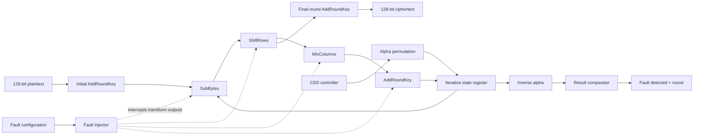
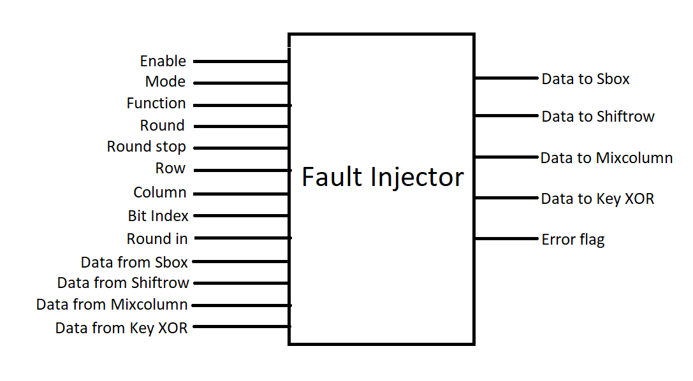

# RIPO-AES: Concurrent Error Detection for AES-128

An academic hardware-security prototype that adds **time-redundant concurrent error detection (CED)** and a configurable **fault-injection harness** to an iterative AES-128 implementation.

The design explores *re-computing with permuted operands* (RIPO): an AES round is evaluated normally, evaluated again with a byte permutation, transformed back with the inverse permutation, and compared with the original result. The intent is to expose transient and permanent hardware faults without duplicating the full AES datapath.

> [!IMPORTANT]
> It is a research/teaching prototype, not production cryptographic IP. The original flow targets Synopsys VCS mixed-language simulation and has not been independently revalidated in other environments.

## Motivation

Fault attacks deliberately disturb voltage, clock timing, temperature, or internal state so an attacker can compare correct and faulty ciphertexts. Similar corruptions can also arise naturally as transient hardware faults. This project investigates whether an iterative AES core can detect those errors at runtime with modest hardware overhead, accepting reduced throughput in exchange for repeated computation.

## Highlights

- Iterative AES-128 datapath with SubBytes, ShiftRows, MixColumns, AddRoundKey, and key expansion.
- Three controller behaviors: normal encryption, recomputation of every round, or recomputation of one selected round.
- Alpha and inverse-alpha byte permutations for RIPO-style comparison.
- Fault injection at bit or byte granularity.
- Target selection across SubBytes, ShiftRows, MixColumns, and AddRoundKey.
- Single-round or multi-round injection for transient/permanent-fault experiments.
- Mixed SystemVerilog/VHDL implementation with a file-driven simulation testbench.

## Architecture



The fault injector sits between AES transformations and the effective state seen by the next stage. The CED controller schedules normal and permuted passes, then raises `fault_detected` when the de-permuted recomputation differs from the saved result.

## Repository layout

```text
.
|-- README.md
|-- Makefile
|-- docs/
|   |-- project-brief.pdf
|   |-- project-report.docx
|   `-- images/
|-- rtl/
|   |-- systemverilog/      # top level, CED control, fault injection, S-box
|   `-- vhdl/               # AES transforms, package, and key expansion
|-- scripts/
|   |-- clean.py
|   `-- setup_vcs.py
`-- tb/
    |-- aes_128_tb.sv
    `-- vectors/default.txt
```

Generated simulator output is intentionally excluded through `.gitignore`.

## Main modules

| Module | Role |
| --- | --- |
| `aes_128` | Integrates the AES datapath, fault injector, and CED controller. |
| `ced_controller` | Schedules AES rounds, recomputation, permutation, comparison, and alarm generation. |
| `fault_injector` | Flips a selected bit or byte at a selected AES function and round interval. |
| `alpha` / `inv_alpha` | Apply and reverse the byte permutation used during recomputation. |
| `flat_deflat` | Converts between 4 x 4 byte matrices and 128-bit vectors. |
| `keyExpansion` | Produces the ten AES-128 round keys. |
| `sbox_128`, `shiftRow_128`, `mixColumn_128`, `keyXor_128` | Implement the AES round transforms. |

## CED modes

`ced_mode` and `mode_FI` are independent controls: the first selects the error-detection schedule, while the second selects fault granularity.

| `ced_mode` | Behavior |
| --- | --- |
| `2'b00` | Normal iterative AES execution. |
| `2'b01` | Recompute every round for concurrent error detection. |
| `2'b10` | Recompute the round selected by `ced_round`. |
| `2'b11` | Reserved; not implemented in the archived controller. |

## Fault-injector controls

| Signal | Meaning |
| --- | --- |
| `en_FI` | Enables injection. |
| `mode_FI` | `0`: flip one bit; `1`: invert one byte. |
| `func_FI` | `0`: SubBytes, `1`: ShiftRows, `2`: MixColumns, `3`: AddRoundKey. |
| `round_FI` | First target round. |
| `round_stop_FI` | Last target round; equal start/stop values produce a one-round injection. |
| `row_FI`, `column_FI` | Select one byte in the 4 x 4 AES state. |
| `bit_index_FI` | Select a bit within that byte when `mode_FI == 0`. |
| `error_FI` | Flags an invalid transform/round combination. |

Round 0 supports AddRoundKey only. Round 10 omits MixColumns, as required by AES.

## Quick start

### Requirements

- A Linux/Unix shell with GNU Make and Python 3.
- Synopsys VCS mixed-language tools: `vlogan`, `vhdlan`, and `vcs`.
- `VCS_HOME` pointing to the Synopsys installation. The preserved debug session identifies VCS `L-2016.06-SP2-7`; newer releases may require small option changes.

From the repository root:

```bash
make compile
make run
cat build/ciphertext.txt
```

To run a different vector file:

```bash
make run INPUT=tb/vectors/my-case.txt OUTPUT=build/my-case.txt
```

Clean generated simulator files with:

```bash
make clean
```

## Test-vector format

The testbench reads three lines. Values are parsed as hexadecimal tokens.

```text
en_FI mode_FI ced_mode ced_round func_FI round_FI round_stop_FI row_FI column_FI bit_index_FI
128-bit AES key
128-bit plaintext
```

Example:

```text
0 0 0 0 0 0 0 0 0 0
0123456789abcdef0123456789abcdef
0123456789abcdef0123456789abcdef
```

The testbench writes the ciphertext to the requested output file and reports the CED alarm, detected round, and fault-injector configuration status on the console.

## Project documents

- [Original project brief](docs/project-brief.pdf) - assignment requirements and deliverables.
- [Original project report](docs/project-report.docx) - motivation and fault-injector design notes.



## Reproduction status and limitations

- The source archive contained generated Synopsys databases and an `out.txt` containing unknown (`x`) values; those artifacts are not included here and no golden ciphertext is claimed.
- The current reorganization environment does not include Synopsys VCS, so the cleaned source tree and build wiring were checked statically but not simulated.
- The testbench uses a fixed simulation interval and is not self-checking against official AES known-answer vectors.
- The controller is an academic prototype with unverified edge cases, particularly selective-round CED and alarm retention.
- VHDL components rely on Synopsys IEEE compatibility packages compiled by `scripts/setup_vcs.py`.

These constraints make the repository a useful starting point for reproduction, modernization, or research rather than a drop-in verified AES core.

## Suggested next steps

- Add NIST AES-128 known-answer tests and automatic pass/fail checks.
- Port the mixed-language design to a single HDL or add an open-source mixed-language flow.
- Add assertions for round sequencing, legal injection targets, and alarm behavior.
- Measure fault-detection coverage, latency, throughput, and hardware overhead.
- Add CI linting and reproducible wave dumps.

## Background and attribution

Developed by **Aakash Shah and Saad Rahman** for **CMPE/ENEE 691 - Hardware Security**, taught by **Dr. Naghmeh Karimi** at the University of Maryland, Baltimore County (Fall 2017).

The CED approach is based on:

> X. Guo and R. Karri, “Re-computing with permuted operands: A concurrent error detection approach,” *IEEE Transactions on Computer-Aided Design of Integrated Circuits and Systems*, vol. 32, no. 10, pp. 1595-1608.

Portions of the AES VHDL baseline identify Michael Muehlberghuber and the Integrated Systems Laboratory at ETH Zurich in their source headers. Preserve those notices when redistributing the code.

## License

No software license was present in the original archive, so no license has been added here. Copyright remains with the respective authors. Obtain permission before reuse or redistribution beyond applicable academic or fair-use contexts.
